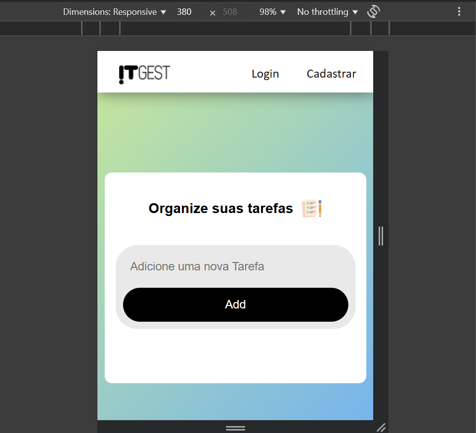

# 📋 TaskFlow — Sua Lista de Tarefas Inteligente

 
 
 
TaskFlow é uma aplicação web moderna de gerenciamento de tarefas (ToDo List), criada com o objetivo de proporcionar aos usuários uma maneira intuitiva, segura e eficiente de organizar seu dia a dia. Com foco em usabilidade, performance e segurança, o projeto oferece uma interface limpa, autenticação robusta e armazenamento persistente.

### 🚀 Funcionalidades
 - ✅ Criação, edição e exclusão de tarefas

 - 🔒 Autenticação de usuários (login e senha)

 - 📦 Banco de dados MySQL com Sequelize

 - 👤 Tarefas associadas a usuários únicos

 - 🍪 Sistema de cookies para gerenciamento de sessões

 - ⚙️ Backend robusto em Node.js
 

## 🍪 Sistema de Cookies
O TaskFlow utiliza cookies para gerenciar sessões de usuários de forma segura e persistente. Após o login, um cookie de sessão é criado, permitindo que o usuário permaneça autenticado por determinado tempo sem a necessidade de novo login.

Os cookies armazenam informações essenciais de forma segura (sem conter senhas).

O controle de acesso é gerido a partir desses cookies, protegendo as rotas privadas.

Isso proporciona uma experiência fluida sem comprometer a segurança do usuário.

## 🔐 Criptografia
O módulo de autenticação utiliza hashing de senhas (por exemplo, via bcrypt) para proteger as credenciais dos usuários. Assim, mesmo que haja acesso indevido ao banco de dados, as senhas estarão devidamente criptografadas, tornando-as praticamente inacessíveis.

### Vantagens do uso de criptografia:

- Proteção contra ataques de força bruta e dicionário.

- Cumprimento de boas práticas de segurança da informação.

- Redução do risco em caso de vazamento de dados.

## 🧠 Estrutura Técnica
A arquitetura do projeto é dividida entre frontend, backend e banco de dados:

Backend
Gerenciado com Node.js e Express.js

ORM Sequelize para comunicação com o banco de dados MySQL

Banco de Dados
Modelo relacional com Sequelize

Relacionamento 1:N entre usuários e tarefas

Tabelas criadas: usersl, task

Código de Exemplo (Explicativo)
A modelagem no Sequelize define tarefas com title e done, associadas a um userId

Sincronização automática com sync({ force: false })

## 🖼️ Tecnologias Utilizadas
Abaixo, um resumo visual das principais tecnologias usadas:

      

---

## 🛠️ Como Rodar o Projeto Localmente
Clone o repositório

bash
Copiar
Editar
git clone https://github.com/seu-usuario/taskflow.git
Instale as dependências

- npm install
- Configure o banco de dados MySQL --
- Atualize datatbase.js com suas credenciais e execute o script de inicialização.

Inicie o servidor

- nodemon index.js
📌 

---
Considerações Finais:
O TaskFlow é um projeto ideal tanto para aprendizado quanto para uso prático. Seu foco em boas práticas, segurança e modularidade o torna uma base sólida para aplicações maiores.